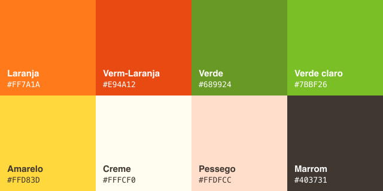

<div align="center">
  

  # Manual de Marca — Mangaba AI

  <sub>Guia de identidade visual e verbal · v1.0</sub>

  📄 **[Baixar em PDF](Mangaba-AI-Manual-de-Marca.pdf)**
</div>

---

## 1. A marca

**Mangaba AI** é um assistente de inteligência artificial **100% local e privado**, com
identidade **brasileira, nordestina e sergipana**. O nome e o símbolo são uma homenagem à
**mangaba** — fruta-símbolo de Sergipe — e à cultura das catadoras de mangaba.

### Essência
| Atributo | Significado |
|---|---|
| **Raiz** | Orgulho sergipano e nordestino; cultura da mangaba |
| **Privacidade** | Roda na máquina do usuário, sem nuvem |
| **Acessível** | Português do Brasil nativo, tom acolhedor |
| **Competente** | Especialista em gestão de empresas |

### Personalidade
Calorosa, acolhedora e prática — com a hospitalidade do Nordeste, sem caricatura.
Fala como uma consultora de confiança: clara, objetiva e próxima.

---

## 2. Logotipo

O símbolo é a **mangaba** (fruta com folha) sobre um cartão de cantos arredondados,
acompanhado do wordmark **mangaba.ai**.

### Usos
- **Logo principal:** versão vertical com fundo (`mangaba-logo.svg`)
- **Favicon / ícone de app:** o símbolo da fruta em cartão
- **Splash / login:** logo centralizado em destaque

### Regras de uso
- ✅ Manter a proporção original (não distorcer)
- ✅ Respeitar a área de respiro (margem mínima = altura da folha da fruta)
- ✅ Usar sobre fundos claros (creme/branco) ou escuros (marrom profundo)
- ❌ Não recolorir o símbolo fora da paleta oficial
- ❌ Não aplicar sombras/contornos não previstos
- ❌ Não usar sobre fundos que reduzam o contraste

### Tamanho mínimo
- Ícone: 32 px
- Logo com wordmark: 96 px de altura

---

## 3. Paleta de cores

Cores extraídas diretamente do logotipo oficial.



### Cores primárias
| Cor | Hex | Uso |
|---|---|---|
| 🟠 **Laranja Mangaba** | `#FF9C24` | Cor principal — botões, destaques, links |
| 🔴 **Laranja-vermelho** | `#F97518` | Hover, alertas, estados ativos |

### Cores de apoio
| Cor | Hex | Uso |
|---|---|---|
| 🟢 **Verde mangaba** | `#689924` | Sucesso, folha, tags |
| 🟢 **Verde claro** | `#7BBF26` | Acentos, gradientes |
| 🟡 **Amarelo polpa** | `#FFD83D` | Realces, gradiente do fruto |

### Neutros
| Cor | Hex | Uso |
|---|---|---|
| 🤍 **Creme** | `#FFF8F5` | Fundo claro principal |
| 🟫 **Pêssego** | `#FFDAC2` | Fundo secundário, gradiente |
| ⬛ **Marrom escuro** | `#1A0F0A` | Fundo do tema escuro |
| ⬛ **Marrom tinta** | `#1E0D01` | Texto principal |

### Gradiente do fruto (símbolo)
`#FFD83D` (amarelo) → `#FF9C24` (laranja) → `#7BBF26` (verde)

### Tokens CSS (em `static/themes/mangaba.css`)
```css
--mangaba-primary:      #FF9C24;
--mangaba-primary-hover:#F97518;
--mangaba-green:        #689924;
--mangaba-green-light:  #7BBF26;
--mangaba-yellow:       #FFD83D;
--mangaba-cream:        #FFF8F5;
--mangaba-peach:        #FFDAC2;
--mangaba-dark:         #1A0F0A;
--mangaba-ink:          #1E0D01;
```

---

## 4. Tipografia

- **Interface:** fonte do sistema — `-apple-system, BlinkMacSystemFont, 'Inter', 'Segoe UI', system-ui`
- **Suavização:** antialiasing ativo; `letter-spacing: -0.011em` para sensação nativa
- **Hierarquia:** títulos em peso semibold; corpo em regular, `line-height` 1.7 para leitura

---

## 5. Tom de voz

A Mangaba sempre fala em **português do Brasil**.

| Faça | Evite |
|---|---|
| Tom acolhedor e próximo | Frieza corporativa |
| Linguagem clara e direta | Jargão técnico desnecessário |
| Passos práticos e acionáveis | Respostas vagas |
| Valorizar a cultura local | Caricatura/estereótipo forçado |

**Exemplos**
- Saudação: *"Olá! Sou a Mangaba 🥭"* / *"Olá, {nome} 🥭"*
- Gestão: *"Vamos organizar seu fluxo de caixa passo a passo?"*
- Privacidade: *"A Mangaba não faz nenhuma conexão externa — seus dados ficam só na sua máquina."*

---

## 6. Aplicações no produto

| Tela | Aplicação da marca |
|---|---|
| **Login** | Logo grande centralizado, botão laranja, fundo creme |
| **Carregamento (splash)** | Logo + barra de progresso com gradiente do fruto |
| **Chat (início)** | Saudação "Olá, {nome} 🥭" + atalhos de gestão |
| **Ícone do app / Dock** | Símbolo da mangaba em cartão |
| **Modelo de IA** | Exibido como **Mangaba Gemma 4** |

---

## 7. Nomenclatura

- **Produto:** Mangaba AI
- **Assistente/IA:** a Mangaba
- **Modelo:** Mangaba Gemma 4 (`mangaba-gemma4`)
- **Domínio/wordmark:** mangaba.ai

> Escreva sempre "Mangaba AI" (com espaço). Evite "MangabaAI" ou "mangaba ai" em texto formal.

---

## 8. Arquivos de marca

| Arquivo | Local |
|---|---|
| Logo oficial (SVG) | `static/mangaba-logo.svg` |
| Tema de cores (CSS) | `static/themes/mangaba.css` |
| Tema refinado da UI | `static/static/custom.css` |
| Ícones gerados (PNG/ICNS) | `scripts/gen-logos.js` gera a partir do SVG |

Para regenerar todos os ícones a partir do logo:
```bash
node scripts/gen-logos.js
```

---

<div align="center">
  <sub>🥭 Mangaba AI — feito no Nordeste, para o Brasil.</sub>
</div>
